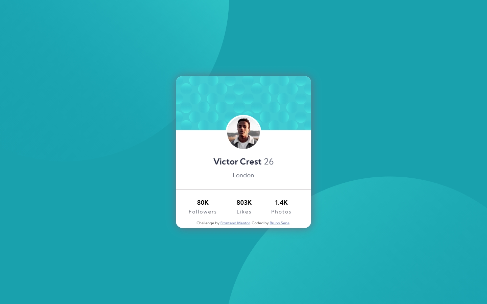

# Frontend Mentor - Profile card component solution

This is a solution to the [Profile card component challenge on Frontend Mentor](https://www.frontendmentor.io/challenges/profile-card-component-cfArpWshJ). Frontend Mentor challenges help you improve your coding skills by building realistic projects. 

## Table of contents

- [Overview](#overview)
  - [The challenge](#the-challenge)
  - [Screenshot](#screenshot)
  - [Links](#links)
- [My process](#my-process)
  - [Built with](#built-with)
  - [What I learned](#what-i-learned)
  - [Continued development](#continued-development)
- [Author](#author)

## Overview

### The challenge

- Build out the project to the designs provided

### Screenshot




### Links

- Solution URL: [GitHub](https://github.com/brujavsen/profile-card)
- Live Site URL: [GitHub-Pages](https://brujavsen.github.io/profile-card/)

## My process

### Built with

- Semantic HTML5 markup
- CSS custom properties
- Flexbox
- Mobile-first workflow

### What I learned

I have learned to reduce more code than usual, for me this has been a great challenge, but I still liked seeing my style more organized.

At first I decided to support myself with HTML5 to make a horizontal line, but I wanted to challenge myself with CSS3:

```css
.line {
    content: '';
    width: 100%;
    border: 1px solid rgb(224, 222, 222);
}
```
### Continued development

The challenges have helped me to progress a lot with CSS, since many properties that can be found in CSS remain a mystery to me and little by little I am organizing ideas and improving based on style. I like to challenge myself, I feel like every time I learn something new without realizing it and when I check my code I can see the progress :D

## Author

- Frontend Mentor - [@brujaven](https://www.frontendmentor.io/profile/brujavsen)
-GitHub - [brujaven](https://github.com/brujavsen)